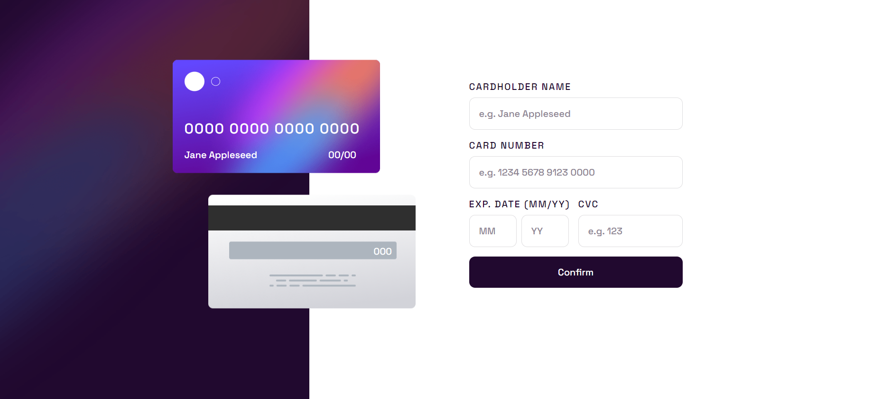

# Interactive card details form

Building realistic projects to improve my front-end skills.

## Screenshots

### Links

- Live Site URL: [Interactive card details](https://1nteractive-card-details.netlify.app/)

## Built with

- Semantic HTML5 markup
- SCSS
- CSS custom properties
- Flexbox
- CSS Grid
- Mobile-first workflow
- [Styled Components](https://styled-components.com/) - For styles
- Media Queries
- DOM Manipulation
